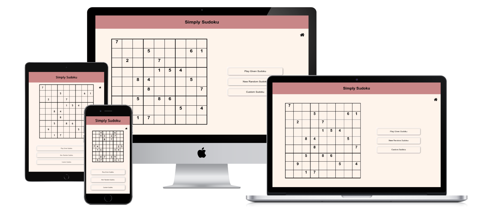

# Simply-Sudoku

Simply Sudoku is a user-generated sudoku app. Users can play sudokus created by others or create their own to play and share with others!

To Play: Simply navigate to the site and you will find a sudoku ready to go! Want a new one? Simply click the "New Random Sudoku" button and you get a brand new sudoku created by another user!

To Create: On the home screen, click the "Custom Sudoku" button. From here you can fill in the givens and then submit your creation! Sudokus must be unique and solvable meaning there must be one unique solution from the givens so that no guessing is required to solve. Once your board is approved, you will be taken to the play screen. It will also be added to the board database so all other users can enjoy as well!

Created using HTML/CSS/JavaScript, jQuery, Node.js, Express, and MongoDB

[simplysudoku.herokuapp.com](https://simplysudoku.herokuapp.com/)
